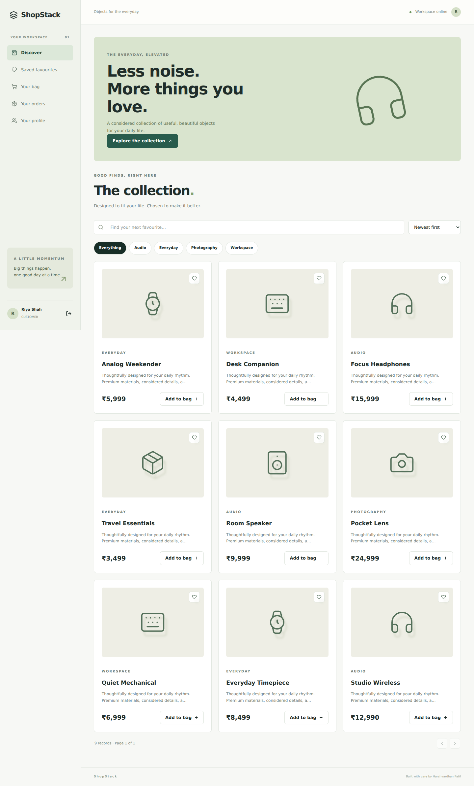

# ShopStack

**A considered commerce platform** · Built by [Harshvardhan Patil](https://github.com/harsh200539)

A storefront backed by server-side pricing, atomic inventory reservations and idempotent payments.

## Features

- Customer and admin authentication, with public catalog APIs.
- Search, categories, sorting, pagination, wishlists and persistent carts.
- Order snapshots with integer paise and priceAtPurchase history.
- Serializable checkout transactions, guarded stock decrements and idempotency keys.
- Explicit simulated demo payments; separate Stripe test Checkout and verified raw-body webhooks.
- Order details, cancellation of unpaid reservations and sequential fulfillment.
- Admin product/inventory/category controls, archiving, customers and revenue analytics.

## Screenshots



## Tech stack

React 19, TypeScript, Vite, Tailwind CSS 4, React Router, TanStack Query, Axios and Lucide. Express 5, TypeScript, Prisma 6, PostgreSQL, Zod, bcrypt and JWT. Vitest, React Testing Library and Supertest. Docker Compose and GitHub Actions.

Stripe test Checkout.

## Architecture and database

The React client calls the Express API. Prisma reads/writes PostgreSQL; authorization is enforced before accessing each resource. The client uses an HTTP-only session cookie and caches API results with TanStack Query. See [`schema.prisma`](server/prisma/schema.prisma) and committed SQL migrations.

User → Cart → CartItem → Product → Category; User → Order → OrderItem → Product; Order → Payment; User → Wishlist; WebhookEvent deduplicates delivery.

- `client/src/App.tsx`: domain pages and flows.
- `client/src/shared.tsx`: session, protected routes, data hooks, dialogs and form controls.
- `server/src/auth.ts`: authentication and administrative user provisioning.
- `server/src/routes.ts`: validated, authorized REST endpoints.
- `server/src/lib.ts`: errors, identity checks, pagination and transaction retries.
- `server/prisma/seed.ts`: repeatable fictional demo data.
- `server/test/integration.test.ts`: security/business integration tests.

## Installation and running locally

Requires Node.js 22+ and PostgreSQL 16+ (or Docker).

```bash
npm ci
cp server/.env.example server/.env
# Edit server/.env with DATABASE_URL, a random JWT_SECRET, and SEED_PASSWORD.
npm run db:generate -w server
npm run db:migrate
npm run db:seed
npm run dev
```

On Windows, use `Copy-Item server/.env.example server/.env` instead of `cp`. Create the `shopstack` database before applying migrations. The API loads `server/.env` because workspace scripts run from the server directory. Vite proxies `/api` locally.

Frontend: `http://localhost:6002` · API: `http://localhost:5002/api`.

Use `admin@shopstack.demo, customer@shopstack.demo` with the password set in `SEED_PASSWORD`. Seeds do not reset existing passwords on repeated runs. Set a real random secret; environment files are ignored by Git.

## Docker

```bash
# Put a random JWT_SECRET in your shell or an ignored root .env file.
# Example: node -e "console.log(require('crypto').randomBytes(48).toString('hex'))"
docker compose up --build -d
docker compose exec server npm run db:seed -w server
```

Open `http://localhost:8080`. PostgreSQL and uploads use named volumes. To run all repositories simultaneously, assign separate `DB_PORT`, `WEB_PORT` and `API_PORT` values in each root `.env`.

## API documentation

Import [`docs/ShopStack.postman_collection.json`](docs/ShopStack.postman_collection.json) into Postman. Update `baseUrl`, record IDs and sample data. Login stores an HTTP-only cookie; Postman reuses the cookie jar. Every non-webhook write needs `X-App-Request: 1`. JSON validation failures return 400, unauthenticated requests 401, forbidden actions 403, scoped missing records 404, and business conflicts 409.

[`docs/API.md`](docs/API.md) lists all implemented endpoints. Lists use `page` and `limit` (1–100); related details return scoped child records. Some small lookup lists have a fixed 100-record cap.

## Authentication and security

- bcrypt password hashes; passwords are 10–72 characters.
- HS256 JWT expires in 8 hours and lives in an HTTP-only cookie.
- Logout and role changes increment the session version, revoking prior JWTs.
- Registration cannot choose elevated roles; the backend reloads the current role.
- Strict Zod write schemas, scoped authorization and bounded pagination.
- Helmet, rate limits, explicit credentialed CORS and a custom write header for CSRF protection.
- Responses exclude password hashes; secrets never enter the React bundle.

For production, set `COOKIE_SECURE=true`. If frontend/API are on unrelated domains, also set `COOKIE_SAME_SITE=none`; use an exact HTTPS `CLIENT_URL`. A same-site custom-domain setup avoids browser third-party-cookie restrictions. Configure trusted proxy handling explicitly for your host rather than blindly trusting forwarded headers.

## Business rules

All amounts are **integer paise**, not floating-point rupees. The browser displays rupees; product editors convert back to paise. Checkout reads the authenticated user's persisted cart, reserves available stock with conditional decrements inside a serializable transaction, then creates order items with price snapshots. The server never accepts a client total.

Stock is reserved **before** opening the payment page. Successful payment confirms the existing reservation; it does not decrement stock twice. This closes the last-unit race. Duplicate checkout keys return the same order; repeated payment events do not repeat effects. Serialization conflicts retry up to four times. Demo reservations expire after 31 minutes and a minute-based API worker releases them; cancellation also releases stock exactly once. Purchased cart quantities are removed while later additions remain.

`PAYMENT_MODE=demo` enables visibly simulated payments. `PAYMENT_MODE=stripe` requires `sk_test_...` and a webhook secret; live keys are deliberately rejected. Webhook signatures, currency and order amount are verified on the raw body. Stripe reservations are released by `checkout.session.expired`, not a local clock, to avoid payment/expiry races. Run reconciliation for undelivered provider events. Refund automation is not included; paid cancellation and anomalous late payments require provider reconciliation.

Product deletion archives the catalog entry; order snapshots keep their original names/prices. Fulfillment goes CONFIRMED → PROCESSING → SHIPPED → DELIVERED.

## Testing

```bash
# Use a dedicated, migrated test PostgreSQL database in DATABASE_URL.
npm test
# Or run SQL integration tests without a PostgreSQL server:
npm run test:embedded
npm run build
```

19 tests cover authentication/forms and domain behavior. CI provisions native PostgreSQL, applies migrations, builds both applications and runs the suites. Local verification also ran the integration suite through an embedded PostgreSQL engine adapter; this does not substitute for multi-process load tests. Tests create uniquely named fixtures and remove their own records.

## Environment variables

Copy the supplied example files. Server: `DATABASE_URL`, `JWT_SECRET`, `PORT`, `CLIENT_URL`, `COOKIE_SECURE`, `COOKIE_SAME_SITE`, `SEED_PASSWORD`. Client: `VITE_API_URL` (defaults to `/api`).

Commerce adds `PAYMENT_MODE`, `STRIPE_SECRET_KEY` and `STRIPE_WEBHOOK_SECRET`. `PAYMENT_MODE=demo` is local demonstration only.

## Deployment

Requested test target: ChatGPT Sites. Hosted testing remains pending; see [verification scope](docs/TESTING.md). The frontend can run on Sites, but the documented Node/PostgreSQL API and Socket.IO server require a compatible backend runtime. Publishing this repository does not deploy the application.

1. For the requested test setup, publish `client/` on ChatGPT Sites after a compatible backend has been configured. Install from the repository workspace root and build with `npm run build -w client`; output is `client/dist`. Set `VITE_API_URL` to the API's HTTPS `/api` URL.
2. Deploy the Express API to a Node/Docker host and provision PostgreSQL. Set server variables, generate Prisma, build, apply migrations and start the API. Backend start from repository root: `npm start -w server`.
3. Set an exact frontend `CLIENT_URL` and secure cookie settings. Bootstrap demo accounts only in a demonstration environment. Do not assume a host's free tier supports persistent files or always-on processes.
4. Configure Stripe test keys and forward `checkout.session.completed`, `checkout.session.async_payment_succeeded` and `checkout.session.expired` to `/api/payments/webhook`. Example: `stripe listen --forward-to localhost:5002/api/payments/webhook`.

## Future improvements

Email verification/password recovery, a refresh-token rotation flow, expanded audit retention and end-to-end load testing. Refund automation, tax/shipping policies, durable provider reconciliation and inventory reservation ledgers.
